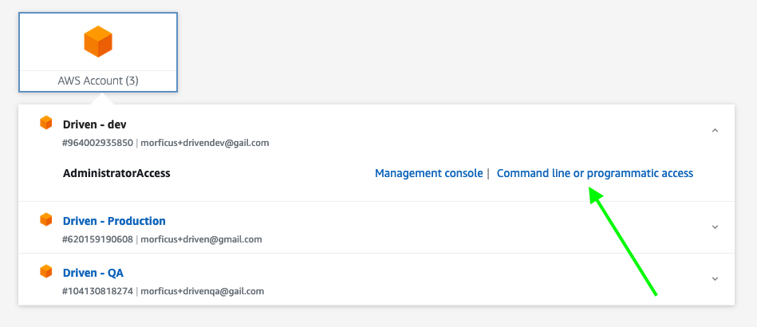
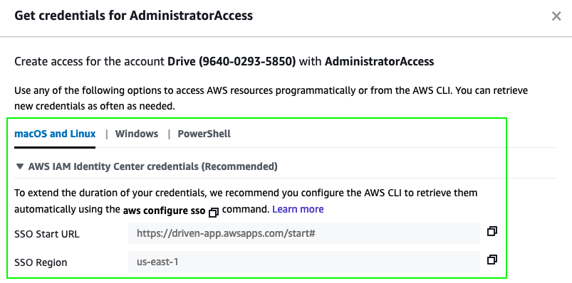

# REST API
As the name implies, REST API that power the Driven app

## Core technologies
- [NodeJS](https://nodejs.org) as the runtime for the API and local build tools
- [Typescript](https://www.typescriptlang.org/) everywhere, for type safety and general code confidence
- [SST](https://sst.dev/) to manage infrastructure related things

## Directory structure explained
- `src`: Contains all the source code for the API
- `src/services`: Each subdirectory in here represents an individual "service" that makes up the API. You can think of a "service" as logical grouping of business capabilities, which manages its own API endpoints, data sources, etc. Each one is able to be deployed independently of the others and they will each have their own `infrastructure.ts` file which holds resourece definitions specific to that service (such as API routes, DB tables, etc)
- `src/utilities`: Contains shared code that can be used by any of the services (such as shared types, helper functions, etc)

## How to run locally

### First time setup
Make sure you have the [AWS CLI](https://aws.amazon.com/cli/) installed.

First, you need to make sure you have access to AWS:
1. Open your browser and go to https://driven-app.awsapps.com/start#/
1. Login with your Driven AWS account information (if you don't have one, ask someone on the team to create one for you)
1. Once you are logged in, you will see a list of AWS accounts you have access to.
1. Expand the one you care about and select "Command line or programmatic access"

1. That will open a pop-up/modal with additinoal instructions on how to setup your AWS credentials locally. Follow those instructions and make sure you have the AWS CLI installed and configured locally. 

1. Follow the on-screen instructions. If you need more help, click on "Learn More" to see the AWS documentation for that topic or feel free to reach out to someone on the team for help.

### Regular dev flow
Once your AWS credentails are setup locally, you can use the following command to start the API and have your changes automatically deployed to the corresponduing AWS environment:
- run `npm run dev:api -- --profile=???` (where `???` is the name of the AWS profile you want to use)

## How to debug locally

Assuming you already have AWS credentials setup locally and you are using VS Code, then you can use the "Run and Debug" functionlaity in VS Code for that. The launch configuration should already be in place.

You can read more about "live lambda debugging" at this URL: https://docs.sst.dev/live-lambda-development#debugging-with-vs-code

## How to create a new service
TBD

## How to deploy
The API and all services will be automatically deployed as part of the CI/CD pipeline. 